## React 

1. 분할 구조정복 : 컴포넌트 안에 컴포넌트 넣기 
2. index를 사용한 select

```react
    <script type="text/babel">
        function MinutesToHours() {
            const [amount, setAmount] = React.useState(0);
            const [inverted, setInverted] = React.useState(false);
            const onChange = (event) => {
                setAmount(event.target.value);
            };
            const reset = () => setAmount(0);
            const onInvert = () => {
                reset();
                setInverted((current)=>!current);}
            return(
            <div>  
                <div>
                <label for="minutes">Minutes</label>
                <input value={inverted ? amount*60 : amount} id="minutes" placeholder="Minutes" type="number" onChange={onChange}  disabled={inverted}/>
                
                <label for="hours">Hours</label>
                <input  value={inverted ? amount : Math.round(amount/60)} id="hours" placeholder="Hours" type="number" onChange={onChange} disabled={!inverted}/>
            </div> 
            <button onClick={reset}>Reset</button>
            <button onClick={onInvert}>{inverted ? "Turn back" : "Invert"}</button>
            </div>
            );
        }
        function KmToMiles(){
            return <h3>KM 2 M</h3>
        }
        // App
        function App() {
            const [index, setIndex]=React.useState("-1");
            const onSelect = (event) => {
                setIndex(event.target.value);
            }
            return(
            <div>  
                <h1>Super Converter</h1>
                <select value={index} onChange={onSelect}>
                    <option value="-1">Select</option>
                    <option value="0">Minutes & Hours</option>    
                    <option value="1">KM & Miles</option>    
                </select>
                <hr />
                {index === "-1" ? "Please select your units" : null}
                {index ==="0" ? <MinutesToHours /> : null}
                {index ==="1" ? <KmToMiles /> : null}
            </div>
            );
        }
        const root = document.getElementById("root");
        ReactDOM.render(<App />, root);
    </script>
```

__3. Props__

	- 부모 > 자식
	- 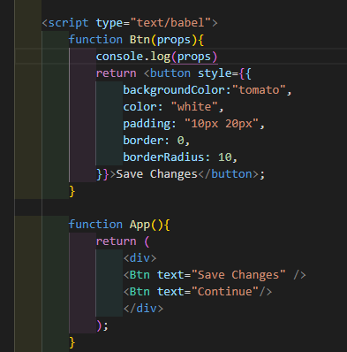
	- 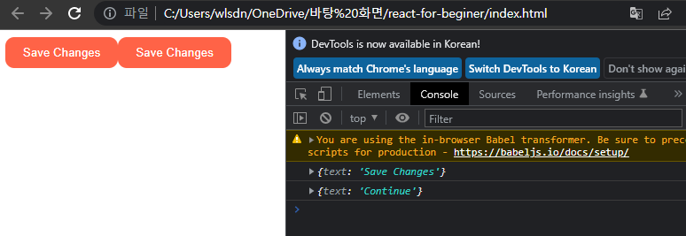

- 적용
- 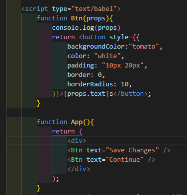
- 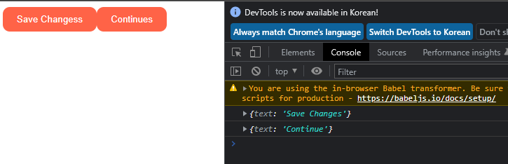
- shortcut
- 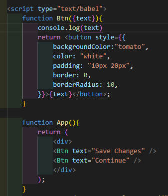

- 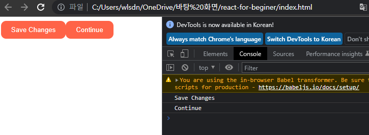

- 인자 2개 props

- 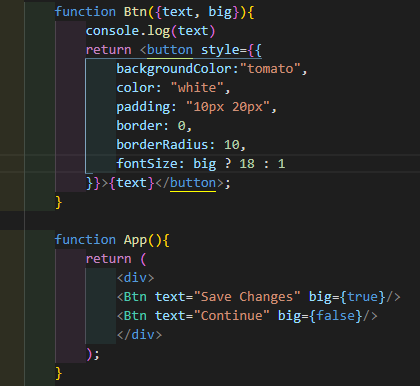

- 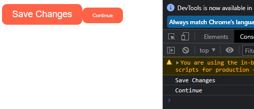

---

__props type__

`propTypes` 설치

ex) ` PropTypes.number.isRequired`

---

__create-react-app__

1. nodejs 설치

2. ```
   npx create-react-app my-app 
   ```

3. ```
   npm run
   ```

4. src  : 나의 모든 파일을 넣을 폴더

5. indx.js : 리액트 어플리케이션 렌더링

6. App.js

7. prop-type : `npm i prop-types`

   - 사용

     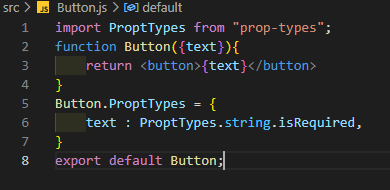

8. css

   1. css파일 만들기 -> index.js에서 import해서 사용 (비추)

   2. module.css :star:

         - src/Button.module.css 생성

         - ```css
           .button{
           	color : white;
           	backgroundColor: tomato;
           }
           ```

         - ​	Button.js에서 import 해서 사용

         - ```js
           import styles from "./Button.module.css";
           <button className={styles.title}></button>
           ```

9. practice

   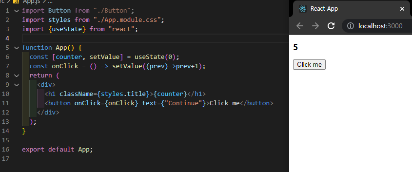


10. :star2: state가 변할때 component는 다시 실행 됨 :star2:

11. 하지만 API data를 받아오거나 할때 코드가 재실행 되는 것을 막아야 함

    :point_right:useEffect 사용!

    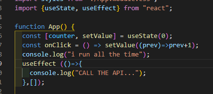

12. `const [counter, setValue] = useState(0);`
    - ['value', 'value를 modify하는 function']

13. 코드의 특정 부분만 변화시 특정 코드만 실행하고 싶을 때 :sparkles:
    - keyword가 변할때 만약 keyword가 조건에 맞을때 console출력
    - 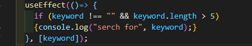  
    - 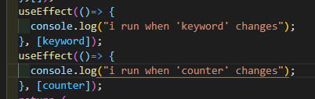